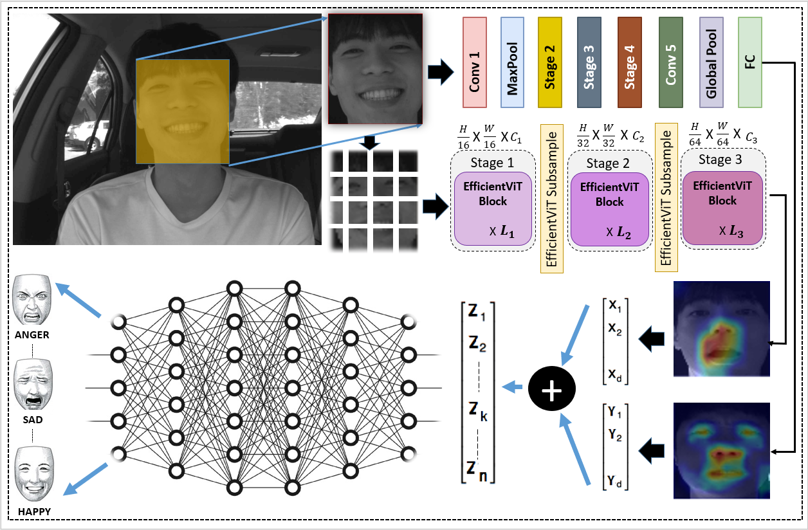
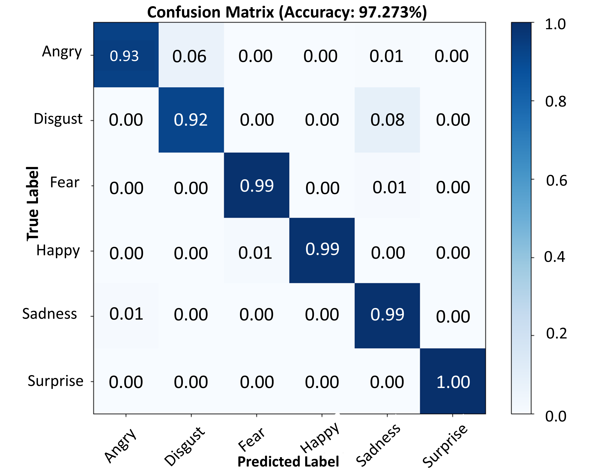
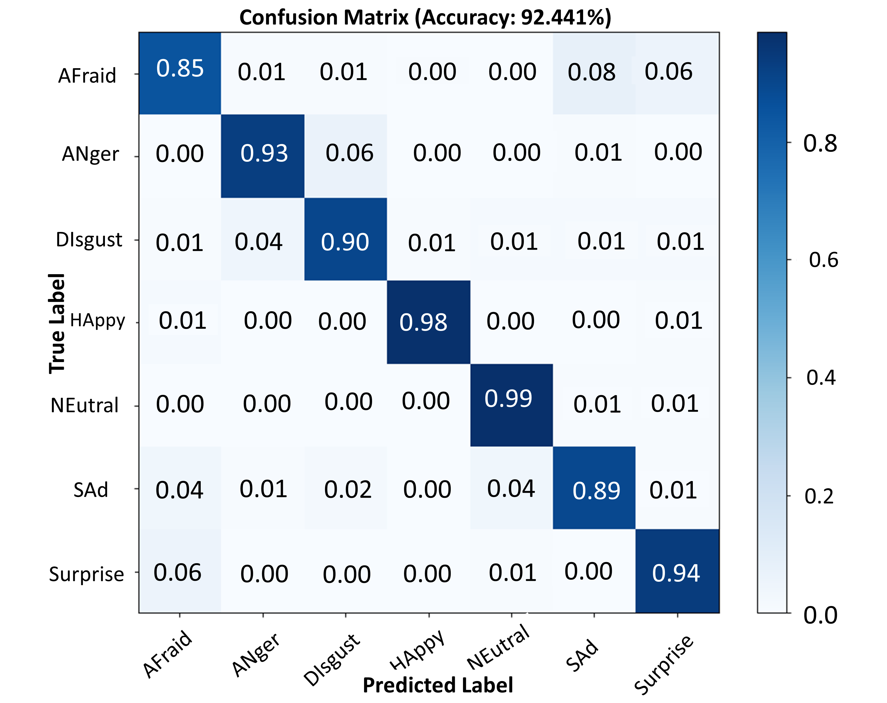

# Shuffle Vision Transformer: Lightweight, Fast and Efficient Recognition of Driver’s Facial Expression

This is the **official repository** for the [**paper**](https://arxiv.org/abs/) "*Shuffle Vision Transformer: Lightweight, Fast and Efficient Recognition of Driver’s Facial Expression*".

# ShuffViT-DFER Architecture

  

## Datasets ##
- KMU-FED dataset from https://cvpr.kmu.ac.kr/KMU-FED.html
- KDEF from https://kdef.se/download-2/index.html

### Preprocessing ###
-*For KMU-FED dataset*: 'python preprocess_kmu.py' to save the data in .h5 format, then, "KMU.py" to split the data into 10 folds.  
-*For KDEF dataset*: 'python preprocess_KDEF.py' to save the data in .h5 format, then, "KDEF.py" to split the data.  

### Train and Test model for all 10 fold ###
- *KMU-FED dataset*: python 10fold.py
- *KDEF dataset*: python combinedmodelkdef.py --model Ourmodel --bs 32 --lr 0.0001

### plot confusion matrix ###
- python confmatrixkmu.py --model Ourmodel
- python confmatrixkdef.py --model Ourmodel

###  KMU-FED Accurary     ###
We use 10-fold Cross validation in the experiment.
- Model：    ShuffViT-DFER ;       Average accuracy：  97.273%   

###  KDEF Accurary     ###
- Model：    ShuffViT-DFER ;       Accuracy：  92.441%   

### Confusion matrices ###

  
  

